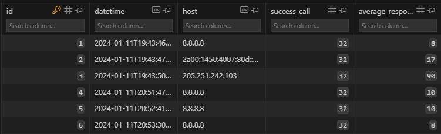

# ping-scanner

This project is a minimal application deployed as docker image to regularly ping some urls, allowing you to track ping volatility.

## How to use:

You need to provide:

 - 1 config file as yaml

```yaml
---
app:
  database_path: ./out/result.sqlite
  whitelist_path: ./out/whitelist.txt
  ping_interval: 60
```

 - 1 list of ips (V4 or V6) to call regularly ()

```
8.8.8.8
2a00:1450:4007:80d::200e
205.251.242.103
```

Then you can run the image by providing config file and whitelist in volumes:

```
docker run -it -v config:/app/config -v out/:/app/out --net=host ping-scanner:0.1.0
```

The database will looks like:



## Build the image & Debug

The image is not published so you need to build it using:

```
docker build . -t ping-scanner:0.1.0
```

Then you can test & debug

```
docker run -it -v config:/app/config -v out/:/app/out --entrypoint /bin/sh --net=host ping-scanner:0.1.0

# or with full path for Windows
docker run -it -v C:\path\to\config:/app/config -v C:\path\to\out:/app/out --entrypoint /bin/sh --net host ping-scanner:0.1.0
```

## Troubleshooting

For IP V6, you need to enable the option in the daemon: https://docs.docker.com/config/daemon/ipv6/